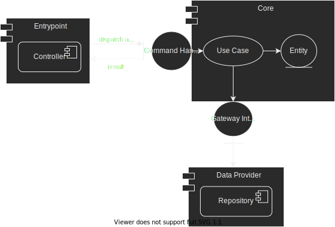

# Authorizer

This is a [Java 11](https://devdocs.io/openjdk~11/) project that authorizes transactions for a specific account following a series of predefined rules.
It uses [Docker](https://docs.docker.com/get-started/overview/) and [Docker-Compose](https://docs.docker.com/compose/) to package and run.

## Summary

1. [Project details](#project-details)
   1. [Design](#design)
   2. [Frameworks and libraries](#frameworks-and-libraries)
   3. [Structure](#structure)
   4. [Patterns](#patterns)
2. [Build](#build) 
3. [Run](#run)
4. [Future improvements](#future-improvements)

## Project details

### Design

The project design is based on 
the [Clean Architecture](https://blog.cleancoder.com/uncle-bob/2012/08/13/the-clean-architecture.html), 
the [_SOLID_](https://web.archive.org/web/20150906155800/http://www.objectmentor.com/resources/articles/Principles_and_Patterns.pdf) principles 
and some [design patterns](https://refactoring.guru/design-patterns).

As you can see in the diagram above, the project was separated into the following layers:

* _**Entrypoint**_ Layer:
    * Responsible for communication with the user.
    * Processes the input entered, generates a command, calls the _**Core**_ layer and returns result to the user.

* _**Core**_ Layer:
    * Responsible for encapsulate and implement all the business rules into _use cases_ and _entities_ and it has no
      dependencies with other layers.
    * The _use cases_ orchestrate the flow of data to and from the _entities_, and direct those _entities_ to use their
      enterprise wide business rules to achieve the goals of the use case.
    * The _use cases_ combine data from 1 or multiple gateway interfaces, which are implemented in the _**Data
      Provider**_ layer.

* _**Data Provider**_ Layer:
    * Responsible to coordinate data from the different Data Sources.
    * Implements the Domain Gateway Interface and is in charge of combining 1 or multiple Repositories.

### Frameworks and libraries

* [Spring Boot](https://spring.io/projects/spring-boot):
  It offers a fast way to build applications.
  It looks at your classpath and at the beans you have configured, makes reasonable assumptions about what you are missing, and adds those items.
  It provides opinionated 'starter' dependencies to simplify your build configuration.
  With it, we can focus more on business features and less on infrastructure.

* [Jackson](https://github.com/FasterXML/jackson):
  It is a suite of data-processing tools for Java (and the JVM platform), including the flagship streaming JSON parser / generator library

* [Lombok](https://github.com/projectlombok/lombok):
  It is a Java library focused on productivity and boilerplate code reduction through annotations added to our code.

* [JUnit](https://junit.org/junit5), [Mockito](https://site.mockito.org/) and [Jacoco](https://www.eclemma.org/jacoco/):
  For Testing and Coverage.
  
### Structure

* [_main/docker_](src/main/docker): Docker files.
* [_main/java_](src/main/java): Java source code.
    * [_core_](src/main/java/org/authorizer/core): _**Core**_ Layer.
        * [_config_](src/main/java/org/authorizer/core/config): Core config.
        * [_entity_](src/main/java/org/authorizer/core/entity): Entities of the project.
        * [_gateway_](src/main/java/org/authorizer/core/gateway): Gateway interfaces.
        * [_handler_](src/main/java/org/authorizer/core/handler): Command Handler.
        * [_usecase_](src/main/java/org/authorizer/core/usecase): Use cases of the project.
            * [_dto_](src/main/java/org/authorizer/core/usecase/dto): Data Transfer Objects using to moving the data to and from the use cases.
            * [_impl_](src/main/java/org/authorizer/core/usecase/impl): Use cases implementations
            * [_rule_](src/main/java/org/authorizer/core/usecase/rule): Validation rules.
    * [_dataprovider_](src/main/java/org/authorizer/dataprovider): _**Data Provider**_
      Layer.
        * [_repository_](src/main/java/org/authorizer/dataprovider/repository): Repository implementation.
    * [_entrypoint_](src/main/java/org/authorizer/entrypoint): _**Entrypoint**_ Layer.
        * [_shell_](src/main/java/org/authorizer/entrypoint/shell): User interactions using shell
            * [_config_](src/main/java/org/authorizer/entrypoint/shell/config): Configurations for this module.
            * [_dto_](src/main/java/org/authorizer/entrypoint/shell/dto): Data Transfer Objects using to moving the data from the client to the project and vice versa.
            * [_impl_](src/main/java/org/authorizer/entrypoint/shell/impl): Controller implementations

* [_main/resources_](src/main/resources): Project Resources.

* [_test/java_](src/test/java): Java source code for testing.
    * [_builder_](src/test/java/org/authorizer/builder): Builders to assist testing
    * [_core_](src/test/java/org/authorizer/core): _**Core**_ Layer Tests.
    * [_dataprovider_](src/test/java/org/authorizer/dataprovider): _**Data Provider**_ Layer Tests.
    * [_entrypoint_](src/test/java/org/authorizer/entrypoint): _**Entrypoint**_ Layer Tests.

* [_test/resources_](src/test/resources): Test Resources.
    * [_integration-tests_](src/test/resources/integration-tests): Resources for integration testing from each entrypoint type
  
### Patterns

The project uses the [Command pattern](https://refactoring.guru/design-patterns/command) to simplify communication between entrypoint and core layers. 
That way, any new type of entrypoint or operation just needs to know how to create the related command. 
After that, just dispatch the command to the command handler.
More details, see [OperationCommandHandler](src/main/java/org/authorizer/core/handler/OperationCommandHandler.java)

The project creates a chain with all validations rules related with each use case that changes the account state, using the [Chain of Responsibility pattern](https://refactoring.guru/design-patterns/chain-of-responsibility).
More information at [AccountValidateRule](src/main/java/org/authorizer/core/usecase/rule/AccountValidateRule.java)

## Build

The [build.yml](build.yml) file has the configuration needed to build and testing the application. 
For that, just run:

    docker-compose -f build.yml up & docker-compose -f build.yml down

The first build may take a while because it downloads all maven dependencies.
To increase productivity, it saves all downloaded dependencies in _/.m2_ folder.

After running the build, the application executable will be inside the _target_ folder and the test results will be in the _site_ folder.

## Run

The [shell.yml](shell.yml) file has the configuration needed to start the application after the build.
To do it, just run:

    docker-compose -f shell.yml up -d

A container named shell-authorizer will be created, so we can call it to receive a file contents through _stdin_ by running the following command:

    docker exec -i shell-authorizer sh -c "java ${JAVA_OPTS} -jar app.jar" <text.txt

The result will appear in the _stdout_. To stop the application, just run:

    docker-compose -f shell.yml down

## Future improvements

* Create integration tests to validate input json conversion errors.
* Improving application errors, logging, tracing and monitoring.
